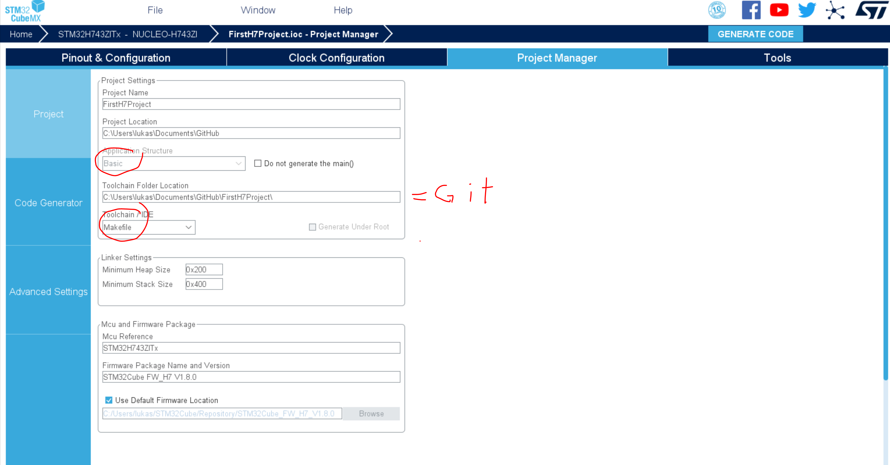
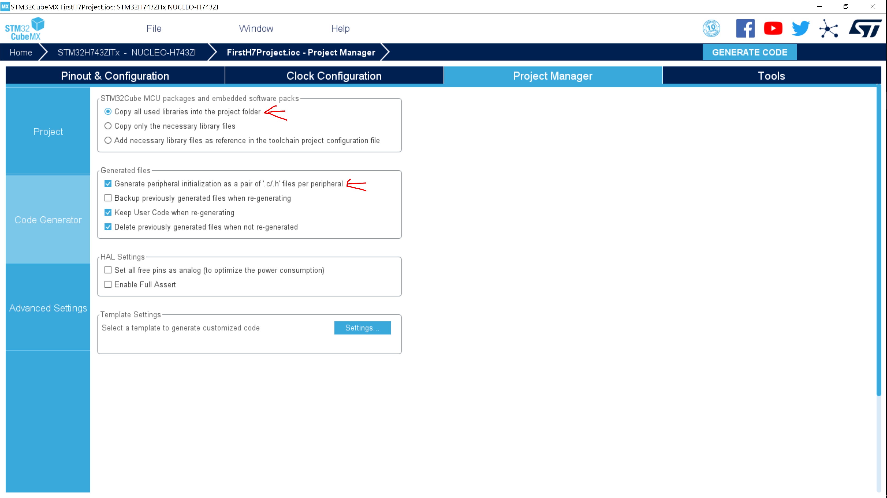

# FirstH7Project

Ziel: simple ersten code compilen und uebertragen. Debugger testen.


Anleitung zum Compilen mit vscode:
https://marketplace.visualstudio.com/items?itemName=bmd.stm32-for-vscode#

Github Repo:
[Github stm32-for-vscode](https://github.com/bmd-studio/stm32-for-vscode)

All die Plugins muessen installiert und im PATH hinterlegt werden. STM Plugins und neue Software (CubeMX und ST Link): \
ownCloud\Synth\stm

Als Debugger **OpenOCD**.

## CubeMX export





## CPP Makefile erzeugen

Zu Beginn einmal **ctrl+shift+p** -> **Build STM32 Project** ausfuehren.

Dies erzeugt unter anderem eine **STM32Make.make**. Duplizieren als **STM32MakeCPP.make**.

Zeile 215:
```
$(CC) $(OBJECTS) $(LDFLAGS) -o $@
```
aendern zu
```
$(CXX) $(OBJECTS) $(LDFLAGS) -o $@
```
Damit wird nicht nur mit g++ compiled, sondern auch gelinked. Wirft Sonst den Fehler:
```
undefined reference to `__gxx_personality_v0'
```

Zu guter letzt **main.c** in **main.cpp** umbenennen. Die main.c kann liegen bleiben.

#### CubeMX Project Update
Fuer ein Update des CubeMX Project, **main.cpp** in **main.c** kopieren, CubeMX updaten, und Inhalt wieder zurueck kopieren. CubeMX updatet nur die .c!

Ggf ebenfalls die **.make** Datei updaten, z.B. wenn neue Libs dazu kamen. Selbe Steps wie oben nochmal durch (inkl **Build STM32 Project**).

Alle .c, .cpp und includes muessen in der **.make** aktuell gehalten werden, damit es klappt.

## tasks.json:
Um das Projekt in cpp zu compilen reicht es, eine main.cpp anzulegen und den Inhalt der main.c rueber zu kopieren. Allerdings fehlt nach wie vor die cpp standard library im compile-Befehl.

Diese Tasks compilen mit der cpp standard library
```
{
            "label": "Build STM cpp",
            "type": "shell",
            "command": "make -f STM32MakeCPP.make LIBS=\"-lc -lm -lnosys -lstdc++\"",
            "options": {
                "cwd": "${workspaceRoot}"
            },
            "group": {
                "kind": "build",
                "isDefault": true
            },
            "problemMatcher": [
                "$gcc"
            ]
        },
        {
            "label": "Build and Flash STM cpp",
            "type": "shell",
            "command": "openocd -f interface/stlink.cfg  -f target/stm32h7x.cfg -c 'program build/PROJECTNAME.elf verify reset exit'",
            "options": {
                "cwd": "${workspaceRoot}"
            },
            "group": {
                "kind": "build",
                "isDefault": true
            },
            "problemMatcher": [
                "$gcc"
            ],
            "dependsOrder": "sequence",
            "dependsOn": [
                "Build STM cpp",
            ]
        },
```

Die Tasks koennen mit **ctrl+shift+b** aufgerufen werden. Da gibt auch den Flash-Befehl.

Die Tasks im **ctrl+shift+p** menue muss man evtl irgend wo anders updaten. Der **build and flash to an stm32 platform** Befehl compiled da nach wie vor nicht mit der cpp standard library.

## launch.json:
Damit beim debuggen zuvor ebenfalls mit cpp compiled wird, muss dies hinzugefuegt werden.
```
{
            "showDevDebugOutput": true,
            "cwd": "${workspaceRoot}",
            "executable": "./build/PROJECTNAME.elf",
            "name": "Debug STM32 cpp",
            "request": "launch",
            "type": "cortex-debug",
            "servertype": "openocd",
            "preLaunchTask": "Build STM cpp",
            "device": "stlink",
            "configFiles": [
                "interface/stlink.cfg",
                "target/stm32h7x.cfg"
            ]
        },
```

## c_cpp_properties.json
Aktivierte USB-Modes fuegen dem Projekt Middleware hinzu. Zum korrekten funktionieren von Intellisense in vscode muessen die includes in der **c_cpp_properties.json** ergaenzt werden.

```
"includePath": [
        "Drivers/CMSIS/Device/ST/STM32H7xx/Include",
        "Drivers/CMSIS/Include",
        "Drivers/STM32H7xx_HAL_Driver/Inc",
        "Drivers/STM32H7xx_HAL_Driver/Inc/Legacy",
        "Middlewares/ST/STM32_USB_Device_Library/Class/AUDIO/Inc",
        "Middlewares/ST/STM32_USB_Device_Library/Core/Inc",
        "Inc"
      ],
```

Ebenfalls in der **c_cpp_properties.json**:
```
"compilerPath": "arm-none-eabi-gcc",
```
zu folgendem aendern:

```
"compilerPath": "C:/Program Files (x86)/GNU Arm Embedded Toolchain/9 2020-q2-update/bin/arm-none-eabi-g++.exe",
```

Intellisense von vscode checkt den Aufruf mit der PATH Variable nicht ganz, dadurch stimmt das code linting nicht, includes werden nicht alle erfasst. So gehts.

## Zum sauber halten
* .clang-format
* .gitignore

Koennen aus diesem Projekt kopiert werden.

## Serial Monitor

```
void print(std::string stringbuffer) {
    HAL_UART_Transmit(&huart3, (uint8_t *)stringbuffer.data(), stringbuffer.length(), 100);
}
void println(std::string stringbuffer) {
    stringbuffer.append("\r\n");
    HAL_UART_Transmit(&huart3, (uint8_t *)stringbuffer.data(), stringbuffer.length(), 100);
}
void print(int stringbuffer) {
    print(std::to_string(stringbuffer));
}
void println(int stringbuffer) {
    println(std::to_string(stringbuffer));
}
...
```
Als Template noch zu testen. DMA noch zu testen. UART3 ist in diesem Falle ueber USB Pins ebenfalls zum Computer verbunden. Ggf im Datenblatt checken.

im Device Manager unter Ports den COMx Port heraussuchen.

In Putty zu entsprechendem Port als Serial Monitor verbinden, BAUD 115200.

## offene Fragen

* weitere Libraries einfuegen (geht ueber den task Befehl, siehe [GitHub issue](https://github.com/bmd-studio/stm32-for-vscode/issues/29))
* build mit anderen optimization levels

## etc
Als alternative habe ich ebenfalls PlatformIO getestet, aber die verwendeten Treiber fuer den Chip sind dort leider viel zu alt und mit unserem Board nicht mehr kompatibel.